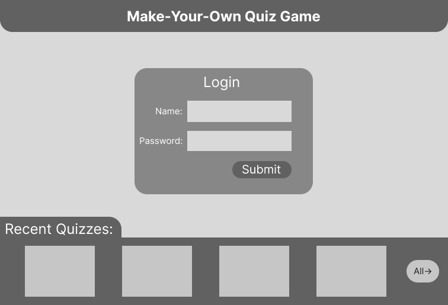
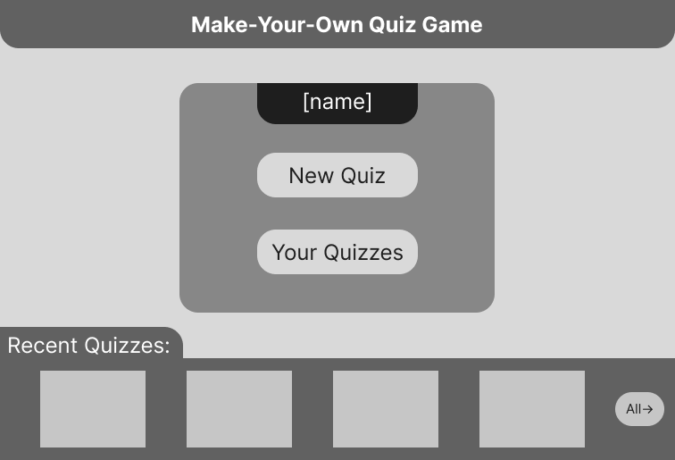
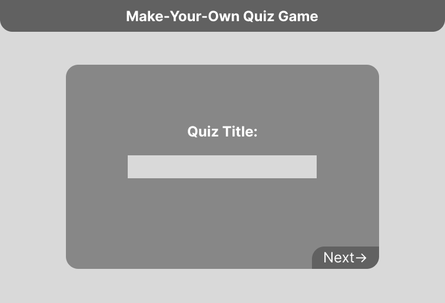
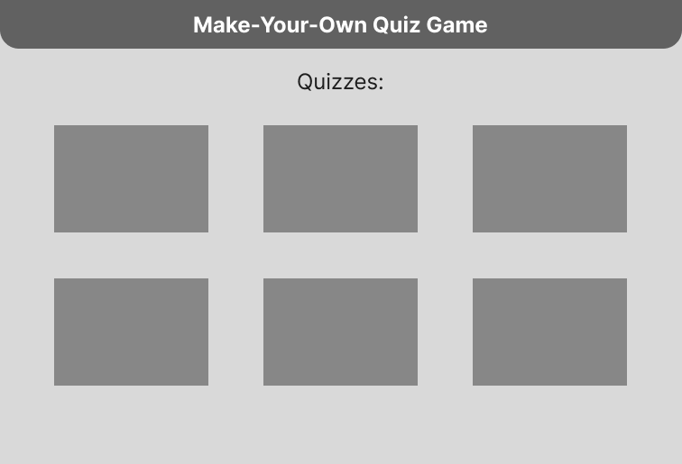

# Make-Your-Own Quiz Game

## Description deliverable

### Elevator pitch

The best games are the ones you make yourself--thus, the make-your-own quiz game: the easist way to create a multi-choice quiz for others to test their mettle with. Simply sign in, make a quiz, and submit it for others to take--the topic and questions are entirely up to you.

### Design

### Key features

* Login to account
* Quiz titling and creation, storing completed quizzes

* Taking quizzes made by other users
 
 
 * Displays score of taken quizzes

 ### Technologies

 - **HTML** - 5(?) pages of HTML, links to each page  
 - **CSS** - arrangement of elements, use of whitespace, adapts to screen size
 - **JavaScript** - Login information, opening quizzes, saving quizzes, etc.
- **Service** - All the backend for login, retrieving past quizzes, submitting quizzes
- **DB** - Store quizzes and users in database
- **Login** - Allows users to create an account and securely login, cannot take or create quizzes without account
- **WebSocket** - Past quizzes are available to all users
- **React** - Porting to React